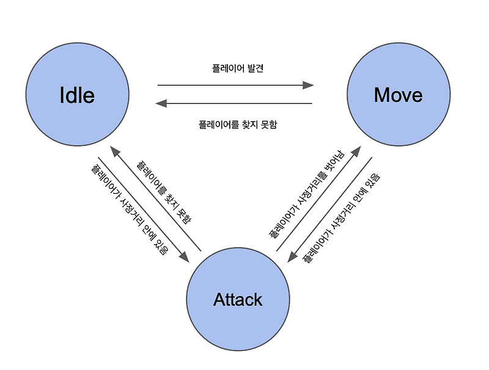

# 상태 패턴: FSM

상태 패턴(State Pattern)은 상태에 따라 동작이 달라지는 객체를 구조적으로 설계하기 위한 패턴이다.

하지만 상태 패턴을 제대로 이해하려면 그 이전에 반드시 짚고 가야 할 개념이 있다.

바로 **FSM(Finite State Machine)** 이다.

상태 패턴은 FSM을 객체지향 코드로 구현하는 방법 중 하나다.

---

### FSM이란 무엇인가

FSM은 시스템을 **유한한 상태와 상태 전이로 모델링하는 개념**이다.

FSM의 관점에서 시스템은 다음 성질을 가진다.

- 항상 하나의 상태에 있고
- 이벤트가 발생하면
- 정의된 규칙에 따라 다른 상태로 이동한다.

FSM은 다음 질문에 답하려는 모델이다.

- 지금 상태는 무엇인가
- 이 상태에서 어떤 행동이 가능한가
- 다음 상태는 무엇이어야 하는가

---

### 상태란 무엇인가

FSM에서 상태는  
단순한 값이나 플래그가 아니다.

상태는
- 시스템의 현재 맥락을 나타내고
- 허용되는 행동을 제한하며
- 잘못된 흐름을 차단하는 기준이 된다

예를 들어 주문 시스템을 보면,

```
CREATED → PAID → SHIPPED → COMPLETED
```

각 상태는
- 가능한 행동과
- 불가능한 행동을

함께 정의한다.

---

### FSM이 필요한 이유

상태를 명시적으로 모델링하지 않으면  
로직은 보통 조건 분기로 흘러간다.

```java
if (state == CREATED) {
    // 결제 가능
} else if (state == PAID) {
    // 배송 가능
} else if (state == SHIPPED) {
    // 취소 불가
}
```

상태가 늘어날수록

- 분기는 증가하고
- 누락된 케이스가 생기며
- 잘못된 상태 전이가 숨어들기 시작한다

FSM은 이 문제를 **상태 전이를 명시적으로 정의함으로써** 해결한다.

---

### FSM의 핵심 요소

FSM은 보통 세 가지 요소로 구성된다.

- **상태(State)**
시스템이 가질 수 있는 유한한 상태의 집합이다.

- **전이(Transition)**
한 상태에서 다른 상태로 이동하는 규칙이다.  
모든 상태 간 이동이 허용되지는 않는다.

- **이벤트(Event)**
상태 변화를 유발하는 입력이다.

FSM의 중요한 특징은 **정의되지 않은 전이는 애초에 발생할 수 없게 만든다는 점**이다.

---

### 상태 패턴이란 무엇인가

상태 패턴은 FSM을 객체지향적으로 구현하는 디자인 패턴이다.
상태 패턴의 핵심 아이디어는 단순하다.

> 상태에 따른 행동을  
> 조건문이 아니라 객체로 분리하자

---

### 상태 패턴의 구조

상태 패턴에서는

- 각 상태를 클래스로 만들고
- 상태별 행동을 그 클래스에 위임한다.

컨텍스트 객체는

- 현재 상태만 알고 있고
- 실제 동작은 상태 객체에 맡긴다.

그 결과 코드는 이렇게 변한다.

```java
state.handle();
```

조건 분기는 사라지고 상태별 책임이 분리된다.

---

### FSM과 상태 패턴의 관계

이 둘의 관계는 다음과 같다.

- FSM은 **개념**
- 상태 패턴은 **구현**

FSM은 여러 방식으로 구현될 수 있다.

- if / else
- switch
- 테이블 기반
- 상태 패턴

즉,

```
FSM ⊃ 상태 패턴
```

상태 패턴은 FSM의 한 구현 전략일 뿐이다.

---

## 언제 상태 패턴을 써야 하는가

FSM이 있다고 해서 항상 상태 패턴을 써야 하는 것은 아니다.

상태 수가 적고 행동이 단순하다면 조건문이 더 명확할 수도 있다.

상태 패턴은

- 상태가 많아지고
- 상태별 행동이 복잡해지며
- 변경 가능성이 높아질 때

가치를 가진다.

---

## 정리

FSM은 시스템을 상태와 전이로 바라보는 모델이다.

상태 패턴은 그 FSM을 객체지향 코드로 구현하는 방법이다.

상태 패턴을 이해하려면 먼저 FSM을 이해해야 한다.

FSM을 건너뛴 상태 패턴은 결국 또 다른 형태의 조건 분기가 된다.
