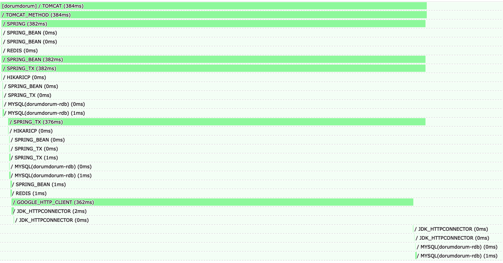
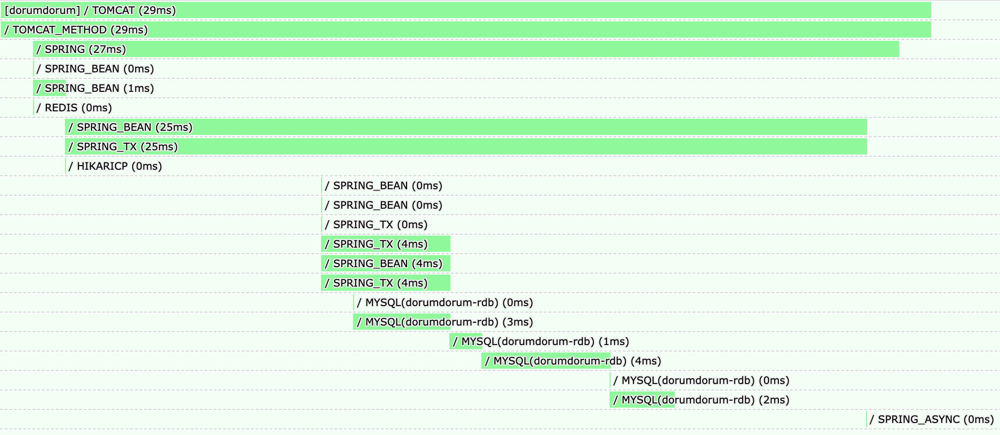

# 알림 시스템 구현 (2) - 외부 IO는 트랜잭션 밖으로

채팅 알림 기능을 구현하면서 처음에는 메시지 저장, 알림 생성, 푸시 전송까지 하나의 흐름으로 처리했다. 기능 자체는 잘 동작했다. 메시지가 저장되면 상대방에게 알림이 전송되고, 사용자 입장에서도 기대한 동작을 바로 확인할 수 있었다.

문제는 부하가 걸렸을 때 드러났다. 요청 수가 늘어나자 응답 시간이 급격히 증가했고, 결국 일부 요청은 500 에러로 실패했다. 처음에는 커넥션 풀 설정 문제라고 생각했지만, 원인을 따라가 보니 병목의 핵심은 다른 곳에 있었다. **외부 IO 작업이 트랜잭션 내부에 들어와 있던 구조**가 문제였다.

이번 글에서는 그 과정을 정리해보려고 한다.  
부하 테스트에서 어떤 병목이 발견되었는지, 왜 단순한 커넥션 풀 튜닝만으로는 해결되지 않았는지, 그리고 왜 외부 IO를 트랜잭션 밖으로 분리하게 되었는지를 중심으로 다룬다.

---

## 1. 문제 상황

'도룸도룸'에서는 채팅 메시지가 전송되었을 때 상대방에게 알림을 보내야 했다. 사용자가 앱을 보고 있지 않더라도 새로운 메시지를 놓치지 않게 하려면 푸시 알림이 필요했다. 그래서 채팅 메시지 전송 기능 안에서 알림 생성과 Firebase FCM 전송까지 함께 처리하는 구조를 먼저 만들었다.

초기 흐름은 다음과 같았다.

```text
채팅 메시지 저장
→ 알림 저장
→ FCM 전송
→ 트랜잭션 종료
```

기능적으로는 문제가 없었다. 메시지가 정상적으로 저장되고, 알림도 전송되었다. 하지만 이 구조에는 하나의 문제가 있었다. **외부 네트워크 IO가 트랜잭션 내부에 포함되어 있었다는 점**이다.

이 구조는 평상시에는 크게 문제가 되지 않았다. 하지만 요청이 동시에 몰리는 상황에서는 예상하지 못한 병목이 나타나기 시작했다.

---

## 2. 부하 테스트에서 발견한 병목

100명의 사용자가 5분 동안 1초에 한 번씩 요청을 보내는 부하 테스트를 진행했다.

테스트를 시작한 지 얼마 지나지 않아 몇 가지 문제가 관찰되었다.

- Connection Pool Exhaustion 발생
- 일부 요청에서 500 오류 발생
- p95 응답 시간 증가


특히 로그에서는 다음과 같은 예외가 반복적으로 발생했다.
```
HikariPo0l-1 - Connection is not available, request timed out after 5000ms 
(total = 10, active=10, idle=0, waiting=130)",
```

이는 애플리케이션이 새로운 트랜잭션을 시작하려 할 때 **커넥션 풀에서 DB 커넥션을 획득하지 못했다는 의미**였다.

---

## 3. 처음에는 커넥션 풀 문제라고 생각했다

가장 먼저 보이는 증상은 커넥션 풀 고갈이었다. 그래서 처음에는 HikariCP 설정을 조정하는 방식으로 문제를 해결하려 했다.

커넥션 풀 사이즈를 늘리고, 타임아웃 설정을 조정해 순간적으로 몰리는 요청을 더 많이 처리할 수 있도록 했다.

하지만 이 방식은 근본적인 해결책이 아니었다.

커넥션 풀 튜닝 이후에도 여전히 p95 응답 시간이 높았고, 요청이 몰리는 상황에서는 다시 커넥션 대기가 발생했다.


```
HikariPo0l-1 - Connection is not available, request timed out after 5000ms 
(total = 16, active=16, idle=0, waiting=130)",
```

즉 **커넥션 풀은 병목이 드러나는 지점일 뿐, 실제 원인은 다른 곳에 있을 가능성이 높았다.**

---

## 4. Pinpoint APM으로 원인을 추적했다

좀 더 정확한 원인을 확인하기 위해 Pinpoint APM 트레이스를 분석했다.



트레이스를 따라가 보니 요청 처리 시간의 상당 부분이 **Firebase FCM 전송 구간에서 소비되고 있었다.**

문제는 이 FCM 전송이 **트랜잭션 내부에서 실행되고 있었다는 점**이었다.

즉 요청 흐름은 실제로 다음과 같이 동작하고 있었다.

```text
요청 시작
→ DB 커넥션 획득
→ 트랜잭션 시작
→ 메시지 저장
→ 알림 저장
→ FCM 전송 (GOOGLE_HTTP_CLIENT)
→ 트랜잭션 커밋
→ DB 커넥션 반환
→ 응답 반환 (384ms)
```

여기서 중요한 점은 **FCM 전송이 완료될 때까지 트랜잭션이 종료되지 않는다는 것**이다.

---

## 5. 왜 이 구조가 Connection Pool Exhaustion으로 이어졌을까

Spring에서 `@Transactional`이 적용된 메서드는 실행 시점에 커넥션 풀에서 DB 커넥션을 가져오고, 트랜잭션이 종료될 때까지 해당 커넥션을 점유한다.

문제는 외부 IO 작업이 트랜잭션 내부에 들어와 있으면 **실제 DB 작업이 끝난 뒤에도 커넥션이 계속 점유된다는 점**이다.

외부 IO는 네트워크 상태나 외부 시스템의 처리 속도에 영향을 받기 때문에 응답 시간이 일정하지 않다.

요청 수가 증가하면 다음과 같은 상황이 발생한다.

```text
요청 증가
→ 트랜잭션 증가
→ 커넥션 점유 시간 증가
→ 커넥션 풀 대기 발생
→ Connection Pool Exhaustion
→ 커넥션 획득 실패
→ 500 오류 발생
```

즉 문제는 커넥션 풀 크기가 아니라 **각 요청이 커넥션을 너무 오래 점유하고 있었던 것**이었다.

---

## 6. 해결 전략

Pinpoint APM 분석을 통해 확인한 병목의 원인은 Firebase FCM 전송이 트랜잭션 내부에서 수행되고 있다는 점이었다.  
외부 네트워크 호출이 트랜잭션 안에 포함되면서 실제 DB 작업이 끝난 뒤에도 트랜잭션이 유지되고 있었고, 그동안 DB 커넥션이 반환되지 않으면서 커넥션 풀이 빠르게 소진되고 있었다.

따라서 문제를 해결하기 위해 다음 두 가지 방향으로 구조를 수정했다.

1. 외부 IO 작업을 트랜잭션 밖으로 분리
2. 알림 처리 로직을 비동기 실행으로 전환  

> ### 왜 비동기인가?
> 트랜잭션은 기본적으로 동일한 스레드 내에서 유지된다. Spring의 트랜잭션 컨텍스트는 `ThreadLocal`을 기반으로 관리되기 때문에 같은 스레드에서 실행되는 작업은 동일한 트랜잭션 범위에 포함된다.
반면 비동기 실행은 별도의 스레드에서 수행된다.  
따라서 비동기로 실행되는 작업은 기존 요청 스레드의 트랜잭션 범위에 포함되지 않는다.  
이 특성을 이용하면 외부 IO 작업을 트랜잭션 범위에서 분리할 수 있기 때문에 알림 처리 로직을 비동기로 실행하도록 구조를 변경했다.

핵심 목표는 **트랜잭션 유지 시간을 줄여 DB 커넥션 점유 시간을 최소화하는 것**이었다.


### 1. 외부 IO 작업을 트랜잭션 밖으로 분리

FCM 전송은 외부 네트워크 호출이기 때문에 응답 시간이 일정하지 않다.  
이 작업이 트랜잭션 내부에 포함되면 실제 DB 작업이 이미 끝난 뒤에도 커넥션이 계속 점유된다.

요청 수가 증가하면 커넥션 점유 시간이 누적되면서 **Connection Pool Exhaustion**으로 이어진다.

그래서 외부 IO 작업은 트랜잭션 이후 별도 흐름에서 처리하도록 구조를 변경했다.


### 2. 알림 처리 로직을 비동기 실행으로 전환

처음에는 FCM 전송 부분만 비동기로 분리하는 방법도 고려했다.

하지만 실제 알림 처리 과정은 단순히 FCM 전송만 수행하는 것이 아니라 다음과 같은 여러 단계를 포함하고 있었다.

- 알림 대상 조회
- 사용자 디바이스 토큰 조회
- 알림 채널 결정
- 알림 메시지 생성
- FCM/SSE 전송

이 과정에는 추가 DB 조회나 네트워크 호출이 포함될 수 있기 때문에 요청 처리 스레드에서 수행할 필요는 없었다.

그래서 FCM 전송만 분리하는 대신 **알림 처리 로직 전체를 비동기 실행으로 분리**했다.

이를 위해 Spring의 `@Async`와 `ThreadPoolTaskExecutor`를 사용해 **알림 전용 비동기 스레드 풀**을 구성했다.

이렇게 하면 요청 처리 흐름은 다음과 같이 변경된다.

```
요청 시작
→ DB 커넥션 획득
→ 트랜잭션 시작
→ 메시지 저장
→ 알림 저장
→ 트랜잭션 커밋
→ DB 커넥션 반환
→ 응답 반환

(Async Thread)
→ 알림 대상 조회
→ 사용자 디바이스 토큰 조회
→ 알림 채널 결정
→ 알림 메시지 생성
→ FCM/SSE 전송
```

이 구조를 통해 트랜잭션 내부에서 외부 IO가 제거되었고, 트랜잭션 유지 시간이 크게 줄어들면서 DB 커넥션 점유 시간도 함께 감소했다.

---

## 7. 비동기 처리에서 고려해야 할 점

알림 로직을 비동기로 분리하면서 트랜잭션 내부에서 외부 IO를 제거할 수 있었고, DB 커넥션 점유 시간도 크게 줄어들었다.  
하지만 비동기 처리로 구조를 변경하면서 새로운 고민이 생겼다. 바로 **실패 처리와 데이터 정합성 문제**였다.

외부 시스템 호출은 언제든 실패할 수 있다. 예를 들어 FCM 전송이 네트워크 문제나 외부 서비스 장애로 실패할 수 있다.  
또한 비동기 실행 특성상 작업이 여러 번 수행될 가능성도 있기 때문에 **재처리와 멱등성**을 함께 고려해야 한다.

따라서 비동기 알림 시스템에서는 다음 두 가지가 보장되어야 했다.

- 실패한 작업을 다시 처리할 수 있어야 한다.
- 중복 실행이 발생하더라도 안전해야 한다. (멱등성)

이를 해결하기 위해 여러 접근 방법을 검토했다.

---

### 1. 단순 재시도 로직 (`@Retry`)

가장 간단한 방법은 FCM 전송이 실패했을 때 일정 횟수 재시도하는 방식이다.

```
FCM 전송 실패
→ 일정 시간 대기
→ 재시도
→ 실패 시 다시 재시도
```

이 방식은 구현이 간단하다는 장점이 있지만 몇 가지 문제가 있었다.

- 애플리케이션이 재시도 중에 종료되면 작업이 유실될 수 있다.
- 실패 이력을 안정적으로 관리하기 어렵다.
- 재시도 정책을 운영하기 어렵다.

즉 **일시적인 실패에는 대응할 수 있지만, 시스템 장애 상황에서는 알림 유실 가능성이 존재했다.**

---

### 2. 메시지 큐 기반 처리

또 다른 방법은 Kafka나 RabbitMQ 같은 메시지 큐를 사용하는 방식이다.

```
메시지 저장
→ 이벤트 발행
→ 메시지 큐 전달
→ Consumer가 알림 전송
```

이 방식은 다음과 같은 장점이 있다.

- 비동기 처리에 적합하다.
- 재처리 및 확장성이 좋다.
- 서비스 로직과 알림 처리를 분리할 수 있다.

하지만 이번 서비스에서는 몇 가지 단점이 있었다.

- 메시지 브로커 인프라가 추가로 필요하다.
- 운영 복잡도가 증가한다.
- DB 트랜잭션과 메시지 발행 사이의 정합성 문제를 해결해야 한다.

특히 **트랜잭션 커밋과 메시지 발행 사이의 정합성 문제**를 해결하려면 추가적인 설계가 필요했다.  
러닝커브를 고려했을 때 현재로서는 오버엔지니어링이라고 판단했다.  
추후에 더 많은 트래픽을 감당해야 할 경우 도입을 고려해볼 것 같다.

---

### 3. 이벤트 저장 후 재처리

세 번째 방법은 이벤트를 데이터베이스에 저장한 뒤 별도의 작업이 이를 읽어 처리하는 방식이다.

```
(Thread 1 - Business Logic)
채팅 메시지 저장
→ 알림 이벤트 저장 (INIT)

(Thread 2 - Async)
알림 전송
→ 성공
  → 이벤트 SUCCESS 처리 
→ 실패
  → 재처리 최대 횟수 이하
    → retryCount++, INIT 처리
  → 재처리 최대 횟수 초과
    → FAILED

(Thread 3 - Scheduler)
스케줄러 동작
→ INIT 재처리 (알림 전송)

```

이 방식은 다음과 같은 장점이 있다.

- 이벤트 유실을 방지할 수 있다.
- 실패한 작업을 재처리할 수 있다.
- 별도의 메시지 브로커 없이 구현할 수 있다.

또한 이벤트 저장을 비즈니스 트랜잭션과 함께 수행하면 **데이터 정합성도 보장할 수 있다.**

---

### 최종 선택: Transactional Outbox Pattern

위 방식들을 비교한 결과 트랜잭셔널 아웃박스 패턴(Transactional Outbox Pattern)을 적용하기로 했다.

Outbox 패턴은 비즈니스 데이터와 이벤트를 하나의 트랜잭션으로 저장하고, 이후 별도의 비동기 작업이 해당 이벤트를 처리하는 방식이다.

이번 시스템에서는 Outbox 이벤트 상태를 기반으로 알림 처리 흐름을 다음과 같이 구성했다.

```
(Thread 1 - Business Logic)

채팅 메시지 저장
→ 이벤트 발행
→ 알림 이벤트 저장 (INIT 상태)
```

비즈니스 로직에서는 알림 전송을 직접 수행하지 않고 **Outbox 이벤트만 생성한다.**  
이 작업은 메시지 저장 트랜잭션과 동일한 트랜잭션으로 커밋된다.

---

이후 알림 전송은 별도의 비동기 스레드에서 수행된다.

```
(Thread 2 - Async Notification Worker)

알림 전송
→ 성공
  → 이벤트 상태 SUCCESS
→ 실패
  → 재처리 횟수 증가
  → 이벤트 상태 INIT 유지
```

알림 전송이 성공하면 이벤트 상태를 `SUCCESS`로 변경한다.  
전송이 실패하면 재처리 횟수를 증가시키고 이벤트 상태를 다시 `INIT`으로 유지하여 이후 재처리 대상이 되도록 한다.

---

또한 일정 횟수 이상 실패한 이벤트는 무한 재시도를 방지하기 위해 상태를 `FAILED`로 변경한다.

```
재처리 최대 횟수 초과
→ 이벤트 상태 FAILED
```

---

마지막으로 실패하거나 처리되지 않은 이벤트는 **스케줄러가 주기적으로 재처리한다.**

```
(Thread 3 - Scheduler)

스케줄러 실행
→ INIT 상태 이벤트 조회
→ 알림 전송 재시도
```

이 구조를 통해 다음과 같은 특성을 확보할 수 있었다.

- 비즈니스 데이터와 이벤트 저장의 **트랜잭션 정합성 보장**
- 외부 IO 실패 시 **안전한 재처리**
- 알림 전송 로직과 요청 처리 로직의 **완전한 분리**

결과적으로 비동기 알림 시스템을 **성능과 신뢰성을 모두 고려한 구조**로 구현할 수 있었다.

--- 

## 8. 트랜잭션 아웃박스 적용

먼저 알림 요청 이벤트를 발행한다.

```java
eventPublisher.publishEvent(
    new NotificationRequestEvent(notification)
);
```

Outbox 레코드는 트랜잭션 커밋 직전에 생성되도록 했다.

```java
@Component
public class NotificationOutboxRecordListener {

    @TransactionalEventListener(phase = TransactionPhase.BEFORE_COMMIT)
    public void handle(NotificationRequestEvent event) {

        notificationOutboxRepository.save(
            NotificationOutbox.from(event.notification())
        );
    }
}
```

`BEFORE_COMMIT`을 사용한 이유는 **Outbox 레코드를 기존 트랜잭션과 동일한 트랜잭션으로 묶기 위해서다.**

---
## 9. 알림 전송 비동기 처리

외부 IO를 트랜잭션 밖으로 분리하기 위해 알림 처리 로직은 트랜잭션 커밋 이후 비동기적으로 수행되도록 구성했다.

```java
@Component
public class NotificationRequestListener {

    @Async("notificationExecutor")
    @TransactionalEventListener(phase = TransactionPhase.AFTER_COMMIT)
    public void handle(NotificationRequestEvent event) {
        notificationOutboxDeliveryProcessor.processFromEvent(event);
    }
}
```

`@TransactionalEventListener(phase = TransactionPhase.AFTER_COMMIT)`을 사용해 **트랜잭션이 성공적으로 커밋된 이후에만** 알림 처리가 시작되도록 했고,  
`@Async("notificationExecutor")`를 통해 알림 로직이 **별도의 비동기 스레드**에서 실행되도록 분리했다.

여기서 중요한 점은 비동기로 분리한 대상이 단순히 FCM 전송만이 아니라는 것이다.  
실제 알림 처리 과정에는 다음과 같은 여러 단계가 포함된다.

- 알림 대상 조회
- 사용자 디바이스 토큰 조회
- 알림 채널 결정
- 알림 메시지 생성
- FCM 또는 SSE 전송

즉, 외부 네트워크 호출뿐 아니라 **알림 처리 전반을 요청 처리 스레드에서 분리**한 구조다.

이렇게 변경한 이후 요청 처리 흐름은 다음과 같다.

```text
요청 시작
→ DB 커넥션 획득
→ 트랜잭션 시작
→ 메시지 저장
→ 알림 저장
→ 트랜잭션 커밋
→ DB 커넥션 반환
→ 응답 반환

(Async Thread)
→ 알림 대상 조회
→ 사용자 디바이스 토큰 조회
→ 알림 채널 결정
→ 알림 메시지 생성
→ FCM/SSE 전송
```

이 구조의 핵심은 **트랜잭션이 비즈니스 데이터 저장까지만 책임지고 종료된다는 점**이다.  
기존에는 외부 IO가 끝날 때까지 트랜잭션이 유지되었지만, 구조 변경 이후에는 트랜잭션 커밋과 커넥션 반환이 먼저 이루어지고, 알림 처리는 별도의 스레드에서 이어서 수행된다.

그 결과 요청 처리 스레드가 외부 IO에 묶이지 않게 되었고, DB 커넥션 점유 시간도 함께 줄어들었다.

---

## 10. 전용 비동기 스레드 풀 구성

외부 IO 작업을 처리하기 위해 별도의 ThreadPoolTaskExecutor를 구성했다.

```java
@Bean(name = "notificationExecutor")
public Executor notificationExecutor() {

    ThreadPoolTaskExecutor executor = new ThreadPoolTaskExecutor();
    executor.setCorePoolSize(10);
    executor.setMaxPoolSize(20);
    executor.setQueueCapacity(100);
    executor.setThreadNamePrefix("notification-");
    executor.initialize();

    return executor;
}
```

이렇게 하면 요청 처리 스레드와 알림 전송 스레드를 분리할 수 있다.

---

## 11. 결과
구조 변경 이후 동일한 조건으로 다시 부하 테스트를 진행했다.




- Connection Pool Exhaustion 사라짐
- 500 오류 발생 없음
- p95 응답 시간 감소
- 커넥션 점유 시간 감소
- 요청 처리 시간 384ms → 29ms 감소 (약 92% 개선)

처음에는 커넥션 풀 크기가 문제라고 생각했지만, 실제로는 **트랜잭션 내부에서 외부 IO 작업을 수행하고 있던 구조가 병목의 원인이었다.**

트랜잭션은 가능한 한 짧게 유지하고, 비즈니스 데이터 처리까지만 책임지도록 설계하는 것이 중요하다.  
외부 IO 작업은 트랜잭션 이후 별도의 흐름에서 처리하도록 분리함으로써 요청 처리 경로를 단순화할 수 있었고, 그 결과 응답 시간과 커넥션 사용량 모두 안정화할 수 있었다. 흐름에서 처리하는 것이 성능과 안정성 측면에서 훨씬 유리하다는 것을 확인할 수 있었다.